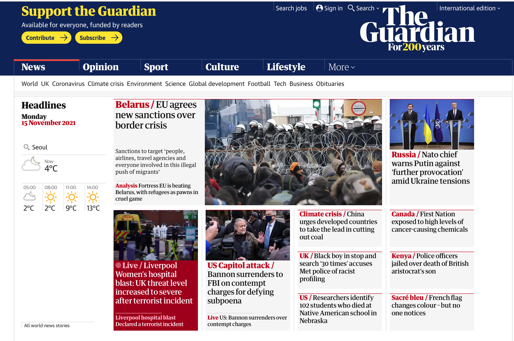
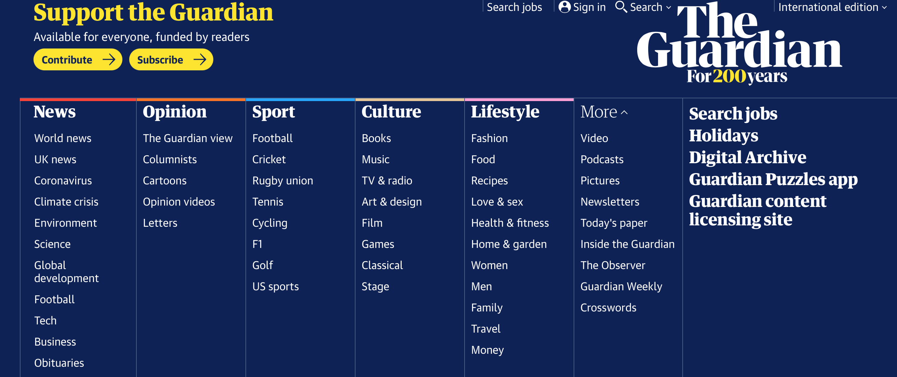

# TheGuardianCrawler

## Goal 
  * Crawling News Data (Article texts, images)

## ToDo List
  1. Pretrained Model(GPT, BERT)
  2. Open Domain Question Answering
  3. Image Classification
  4. Vision Question Answering
  

### 1. Main Page
  1. Source : TheGuardian (international edition)
  2. URL : 'https://www.theguardian.com/international'
  3. Image
    

### 2. News Category
  1. The number of total articles : 204201
  2. Crawling category
        * world
        * uk
        * technology
        * business
        * sport
        * environment
        * culture
  3. Image
    

### 3. Crawling Information
  1. Title (News Title)
  2. Date (Published Date)
  3. Category
  4. Text (Article Text)
  5. Image (Article Image)
  6. Image Description
  7. Image
    
